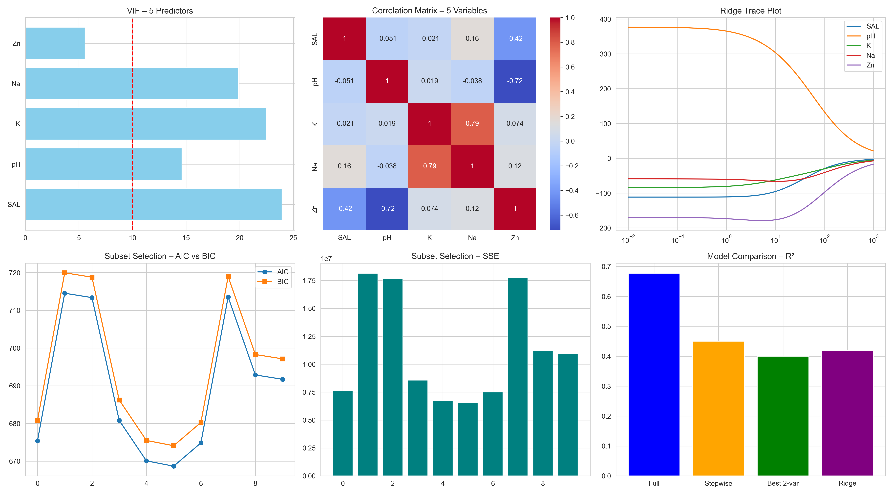

# MATH 564 – Linthurst Regression Project  
**Collinearity Diagnosis, PCR, and Variable Selection**

This project analyzes the **Linthurst soil dataset** to identify physicochemical soil properties that influence **biomass production (BIO)** in the Cape Fear Estuary of North Carolina.  
The analysis follows the exact requirements provided in the project PDF for **Part I (14 predictors)** and **Part II (5 predictors)**.

---

## 📁 Project Structure

```
Regression_Project/
│
├── LINTHALL.txt              # Full dataset (14 predictors)
├── LINTH-5.txt               # Reduced dataset (5 predictors)
│
├── tasks.py                  # Main script: OLS, Collinearity, PCR,
│                             # Stepwise, Subset Selection, Ridge Regression
├── visualizations.py         # Generates figures for Part I and Part II
│
├── part1_analysis.png        # Saved plots – Part I (Collinearity + PCR)
├── part2_analysis.png        # Saved plots – Part II (Variable Selection)
│
├── README.md                 # Project documentation (this file)
└── venv/                     # Local virtual environment (ignored by Git)
```

---

## 🛠 Installation & Environment Setup

### **1. Create a virtual environment**
```bash
python -m venv venv
```

### **2. Activate Environment**

#### **PowerShell**
```bash
venv\Scripts\Activate.ps1
```

#### **Command Prompt**
```bash
venv\Scripts\activate.bat
```

---

## 📦 Install Dependencies

> ⚠️ **Important:** NumPy 2.x breaks `matplotlib` and `pandas`.  
> We explicitly install **numpy==1.26.4** to avoid errors.

```bash
pip install numpy==1.26.4 pandas matplotlib seaborn scikit-learn statsmodels
```

---

## ▶️ Running the Project

### **Run the full statistical analysis (Part I + Part II)**

```bash
python tasks.py
```

This script prints:

- ✔️ OLS regression results  
- ✔️ VIF tables  
- ✔️ Correlation diagnostics  
- ✔️ Condition indices  
- ✔️ PCA + PCR results (with back-transformed coefficients)  
- ✔️ Stepwise regression (α = 0.15)  
- ✔️ Best 2-variable subset selection with AIC/BIC/SSE  
- ✔️ Ridge regression variable selection  

---

## 🖼 Generating Visualizations Only

To generate all figures again:

```bash
python visualizations.py
```

This creates:

- `part1_analysis.png` – VIF, correlations, PCA, CI, OLS vs PCR  
- `part2_analysis.png` – VIF, correlations, ridge trace, AIC/BIC/SSE comparisons  

---

## 📊 Summary of Methods Implemented

### **Part I – 14 Predictors (Full Linthurst Dataset)**  
- OLS estimation  
- VIF analysis  
- Correlation matrix evaluation  
- Condition index & eigenvalue diagnostics  
- PCA + PCR with eigenvalue > 1 rule  
- Comparison of OLS vs PCR coefficients  

### **Part II – 5 Predictors (Reduced Dataset)**  
- VIF & correlation diagnostics  
- Stepwise regression (forward + backward, α = 0.15)  
- Exhaustive subset selection for all 2-variable models  
  - AIC, BIC, SSE, max VIF  
- Ridge regression variable selection  

---

### 📌 Example Outputs

#### Part I – Collinearity & PCA


#### Part II – Variable Selection


---

## 📑 Output Files

- **part1_analysis.png** – Full dataset collinearity + PCA/PCR visuals  
- **part2_analysis.png** – 5-predictor selection visuals  

All results print directly in the terminal when running `tasks.py`.

---

## 🧪 Reproducibility Notes

- All results depend only on LINTHALL.txt and LINTH-5.txt.  
- No randomness is used except PCA component ordering (deterministic).  
- Virtual environment recommended to avoid NumPy 2.x issues.

---

## 👩‍🏫 Course

**MATH 564 – Regression Analysis**  
Illinois Institute of Technology  
Linthurst Soil Dataset Project (BIO ~ Soil Properties)

---

## 📬 Author

Developed by **Anushka Sarath (A20576979)**  
For course submission and academic use.


